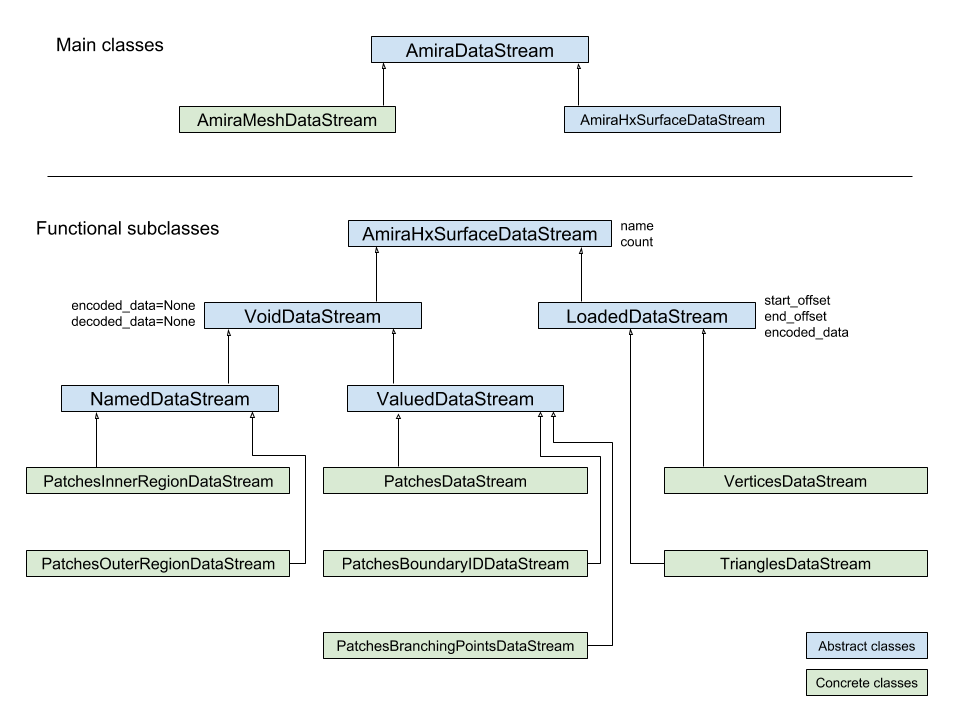

==============================================
``ahds``
==============================================

.. image:: https://readthedocs.org/projects/ahds/badge/?version=latest
    :target: https://ahds.readthedocs.io/en/latest/?badge=latest
    :alt: Documentation Status

.. contents:: Table of Contents

----------------------------------------------
Overview
----------------------------------------------
``ahds`` is a Python package to parse and handle Amira (R) files.
It was developed to facilitate reading of Amira (R) files as part of the `EMDB-SFF toolkit <https://sfftk.readthedocs.io>`_.

.. note::

    Amira (R) is a trademark of Thermo Fisher Scientific. This package is in no way affiliated with with Thermo Fisher Scientific.

----------------------------------------------
License
----------------------------------------------

``ahds`` is free software and is provided under the terms of the Apache License, Version 2.0.

::

    Copyright 2017 EMBL - European Bioinformatics Institute

    Licensed under the Apache License, Version 2.0 (the "License");
    you may not use this file except in compliance with the License.
    You may obtain a copy of the License at

    http://www.apache.org/licenses/LICENSE-2.0

    Unless required by applicable law or agreed to in writing,
    software distributed under the License is distributed on an
    "AS IS" BASIS, WITHOUT WARRANTIES OR CONDITIONS OF ANY KIND,
    either express or implied. See the License for the specific
    language governing permissions and limitations under the License.


Use Cases
==============================================
*     Detect and parse Amira (R) headers and return structured data

*     Decode data (``HxRLEByte``, ``HxZip``)

*     Easy extensibility to handle previously unencountered data streams

``ahds`` was written and is maintained by Paul K. Korir but there is
`a list of contributors <https://github.com/emdb-empiar/ahds/blob/dev/CONTRIBUTORS.txt>`_.
Feel free to join this initiative.

--------------------------------------------
Installation
--------------------------------------------
``ahds`` works with Python 2.7, 3.5, 3.6, 3.7 and 3.8. It requires ``numpy`` to build.


    pip install ahds

--------------------------------------------
Getting Started
--------------------------------------------

You can begin playing with ``ahds`` out of the box using the provided console command ``ahds``.


.. code:: bash

    me@home ~$ ahds ahds/data/FieldOnTetraMesh.am
    ********************************************************************************************************************************************
    AMIRA (R) HEADER AND DATA STREAMS
    --------------------------------------------------------------------------------------------------------------------------------------------
    +-header                                                                                         AmiraFile [is_parent? False]
    |  +-dimension: 3D
    |  +-format: BINARY
    |  +-endian: BIG
    |  +-version: 2.0
    |  +-content_type: None
    |  +-Parameters                                                                                      Block [is_parent? False]
    |  |  +<Parent>: header
    |  +-Tetrahedra                                                                                      Block [is_parent? False]
    |  |  +<Parent>: header
    |  |  +-length: 23685
    |  |  +-Data                                                                           AmiraMeshDataStream [is_parent? False]
    |  |  |  +<Parent>: Tetrahedra
    |  |  |  +-data_index: 1
    |  |  |  +-dimension: 3
    |  |  |  +-type: float
    |  |  |  +-shape: 23685
    |  |  |  +-format: None
    |  |  |  +-interpolation_method: Constant
    |  |  |  +-field_name: f
    ********************************************************************************************************************************************

The ``ahds`` command takes the following arguments

.. code:: bash

    me@home ~$ ahds -h
    usage: ahds [-h] [-s] [-d] [-l] file [file ...]

    Python tool to read and display Amira files

    positional arguments:
      file                a valid Amira file with an optional block path

    optional arguments:
      -h, --help          show this help message and exit
      -s, --load-streams  whether to load data streams or not [default: False]
      -d, --debug         display debugging information [default: False]
      -l, --literal       display the literal header [default: False]

You can specify a **dotted path** after the filename to only render that the content of that field in the header:

.. code:: bash

    me@home ~$ ahds ahds/data/FieldOnTetraMesh.am header.Tetraheder
    ***********************************************************************************************************************************
    ahds: Displaying path 'header.Tetrahedra'
    -----------------------------------------------------------------------------------------------------------------------------------
    +-Tetrahedra                                                                                         Block [is_parent? False]
    |  +<Parent>: header
    |  +-length: 23685
    |  +-Data                                                                              AmiraMeshDataStream [is_parent? False]
    |  |  +<Parent>: Tetrahedra
    |  |  +-data_index: 1
    |  |  +-dimension: 3
    |  |  +-type: float
    |  |  +-shape: 23685
    |  |  +-format: None
    |  |  +-interpolation_method: Constant
    |  |  +-field_name: f


For debugging you can display the literal header (the exact header present in the file) using the ``-l/--literal`` flag.
Also, you can display the parsed data structure using the ``-d/--debug`` flag.

.. code:: bash

    me@home ~$ ahds --literal --debug ahds/data/FieldOnTetraMesh.am
    ***********************************************************************************************************************************
    ahds: Displaying literal header
    -----------------------------------------------------------------------------------------------------------------------------------
    # AmiraMesh 3D BINARY 2.0
    # CreationDate: Tue Nov  2 11:46:31 2004
    
    
    nTetrahedra 23685
    
    TetrahedronData { float[3] Data } @1
    Field { float[3] f } Constant(@1)
    
    # Data section follows
    ***********************************************************************************************************************************
    ahds: Displaying parsed header data
    -----------------------------------------------------------------------------------------------------------------------------------
    [{'designation': {'dimension': '3D',
                      'filetype': 'AmiraMesh',
                      'format': 'BINARY',
                      'version': '2.0'}},
     {'comment': {'date': 'Tue Nov  2 11:46:31 2004'}},
     {'array_declarations': [{'array_dimension': 23685,
                              'array_links': {},
                              'array_name': 'Tetrahedra'}]},
     {'data_definitions': [{'array_reference': 'Tetrahedra',
                            'data_dimension': 3,
                            'data_index': 1,
                            'data_name': 'Data',
                            'data_type': 'float'},
                           {'array_reference': 'Field',
                            'data_dimension': 3,
                            'data_index': 1,
                            'data_name': 'f',
                            'data_type': 'float',
                            'interpolation_method': 'Constant'}]}]
    
    ***********************************************************************************************************************************
    AMIRA (R) HEADER AND DATA STREAMS
    -----------------------------------------------------------------------------------------------------------------------------------
    +-header                                                                                         AmiraFile [is_parent? False]
    |  +-dimension: 3D
    |  +-format: BINARY
    |  +-endian: BIG
    |  +-version: 2.0
    |  +-content_type: None
    |  +-Parameters                                                                                      Block [is_parent? False]
    |  |  +<Parent>: header
    |  +-Tetrahedra                                                                                      Block [is_parent? False]
    |  |  +<Parent>: header
    |  |  +-length: 23685
    |  |  +-Data                                                                           AmiraMeshDataStream [is_parent? False]
    |  |  |  +<Parent>: Tetrahedra
    |  |  |  +-data_index: 1
    |  |  |  +-dimension: 3
    |  |  |  +-type: float
    |  |  |  +-shape: 23685
    |  |  |  +-format: None
    |  |  |  +-interpolation_method: Constant
    |  |  |  +-field_name: f
    ***********************************************************************************************************************************

By default, data streams are not read --- only the header is parsed. You may obtain the data streams using the
``-s/--load-streams`` flag.

.. code:: bash

    me@home ~$ ahds --load-streams ahds/data/FieldOnTetraMesh.am
    ********************************************************************************************************************************************
    AMIRA (R) HEADER AND DATA STREAMS
    --------------------------------------------------------------------------------------------------------------------------------------------
    +-header                                                                                         AmiraFile [is_parent? False]
    |  +-dimension: 3D
    |  +-format: BINARY
    |  +-endian: BIG
    |  +-version: 2.0
    |  +-content_type: None
    |  +-Parameters                                                                                      Block [is_parent? False]
    |  |  +<Parent>: header
    |  +-Tetrahedra                                                                                      Block [is_parent? False]
    |  |  +<Parent>: header
    |  |  +-length: 23685
    |  |  +-Data                                                                           AmiraMeshDataStream [is_parent? False]
    |  |  |  +<Parent>: Tetrahedra
    |  |  |  +-data_index: 1
    |  |  |  +-dimension: 3
    |  |  |  +-type: float
    |  |  |  +-shape: 23685
    |  |  |  +-format: None
    |  |  |  +-interpolation_method: Constant
    |  |  |  +-field_name: f
    |  |  |  +-data:
    |  |  |  |   [[ 8.9173079e-01  9.7118092e-01  3.0000000e+02]
    |  |  |  |    [-1.4623085e-01  7.1288460e-01  3.0000000e+02]
    |  |  |  |    [ 6.3208640e-01 -3.5754296e-01  3.0000000e+02]
    |  |  |  |    ...
    |  |  |  |    [-7.2582179e-01  5.2918231e-01  3.0000000e+02]
    |  |  |  |    [ 1.2271983e-01  4.3120453e-01  3.0000000e+02]
    |  |  |  |    [ 1.4390504e+00  1.1243758e+00  3.0000000e+02]]
    ********************************************************************************************************************************************

----------------------------------------------
Future Plans
----------------------------------------------
*    Write out valid Amira (R) files

----------------------------------------------
Background and Definitions
----------------------------------------------
``ahds`` presently handles two types of Amira (R) files:

*     `AmiraMesh` files, which typically but not necessarily have a ``.am``, ``.elm``, ``.lmb`` extension, and

*     `HyperSurface` files, which have ``.surf`` and represent an older filetype.

Both file types consist of two parts: 

*     a `header`, and 

*     one or more `data streams`. 

Headers are structured in a modified VRML-like syntax and differ between AmiraMesh and HyperSurface files in some of
the keywords used.

A data stream is a sequence of encoded bytes either referred to in the header by some delimiter
(usually ``@<data_stream_index>``, where ``<data_stream_index>`` is an integer) or a set of structural keywords
(e.g. ``Vertices``, ``Patches``) expected in a predefined sequence.

Headers in Detail
==============================================
AmiraMesh and HyperSurface headers can be divided into four main sections:

*     **designation**

*     **declarations**

*     **parameters**, and

*     **definitions**.

The `designation` is the first line and conveys several important details about the format and structure of the file such as:

*     filetype (either ``AmiraMesh`` or ``HyperSurface``)

*     dimensionality (``3D``)

*     format (``BINARY-LITTLE-ENDIAN``, ``BINARY`` or ``ASCII``)

*     version (a decimal number e.g. ``2.1``

*     extra format data e.g. ``<hxsurface>`` specifying that an AmiraMesh file will contain HyperSurface data

        A series of `declarations` defines the sturcture and layout of the data and how many elements the corresponding array, vector or matrix contains. A declaration lline starts with the word ‘define’ or in files created by early Amira versions have ‘n’ prepended. For example:

::

    define Lattice 862 971 200

or 

::

    nVertices 85120


This is followed by grouped `parameters` enclosed in a series of braces beginning with the word ‘Parameters’. Various parameters are then enclosed each beginning with the name of that group of parameters e.g. ‘Materials’

::

    Parameters {
        # grouped parameters
        Material {
            # the names of various materials with attributes
            Exterior {
                id 0
            }
            Inside {
                id 1,
                Color 0 1 1,
                Transparency 0.5
            }
        }
        Patches {
        # patch attributes
            InnerRegion “Inside”,
            OuterRegion “Exterior”,
            BoundaryID 0,
            BranchingPoints 0
        }
        # inline parameters
        GridSize <value>,
        …
    }

The most important set of parameters are materials as these specify colours and identities of distinct segments/datasets within the file.

Finally, AmiraMesh files list a set of `definitions` which detail the type,number of values and name for the item of the indicated data array, vector or matrix declared in the `declarations` section. Each datastream is identified by its unique ``@<number>`` label. We refer to these as data streams because they consist of continuous streams of raw byte data that need to be decoded. Here is an example of `definitions` that define 3D surface primitives encoded by the corresponding datastreams.
::

    Vertices { float[3] Vertices } @1
    TriangleData { int[7] Triangles } @2
    Patches-0 { int Patches-0 } @3

These refer to three raw data streams each found beginning with the delimiter ``@<number>``. Data stream one (``@1``) is called ``Vertices`` and consists of float triples, two is called ``TriangleData`` and has integer 7-tuples and three called ``Patches-`` is a single integer (the number of patches). In some cases the data stream label  includes the data encoding for the corresponding data pointer.

::

    Lattice { byte Labels } @1(HxByteRLE,234575740)

which is a run-length encoded data stream of the specified length, while

::
    
    Lattice { byte Data } @1(HxZip,919215)

contains zipped data of the specified length.

In case a datastream represents a field defined on geometric primitives like vertices, triangles, tetrahedra this indicated by a field defintion. For example:

::

   Field { float[3] f1 } Constant(@1)

The field defintion starts with the keyword ``Field`` repeates the type, number of values and specifies the name of the field. Further this linke inclueds the type of interpolation to be used for example when displaying the field along with the underlying primitive. 


Data Streams in Detail
==============================================
AmiraMesh data streams are very simple. They always have a start delimiter made of ``@`` with an index that identifies the data stream. A newline character separates the delimiter with the data stream proper which is either plain ASCII or a binary stream (raw, zipped or encoded).

HyperSurface data streams structured to have the following sections:

::

    # Header
    Vertices <nvertices>
    # vertices data stream
    
    NBranchingPoints <nbranching_points>
    NVerticesOnCurves <nvertices_on_curves>
    # optional Boundary curves section 
    BoundaryCurves <nboundary_curves>
    {
        Vertices <num_vertices>
        # bounday curve data stream ( vertex indices )
    } # repeats for as <noundary_curves> times

    Patches <npatches>
    { # section for patch 1
    InnerRegion <inner_region_name>
    OuterRegion <outer_region_name>
    BoundaryID <boundary_id>
    BranchingPoints <nbranching_points>
    Triangles <ntriangles>
    # triangles data stream
    } # repeats for as <npatches> times

    # optional surfaces section
    Surfaces <nsurfaces>
    {
        Region <material name>
        Patches <num_patches>
        # surface data stream (patch indices)
    } # repeats for as <nsurfaces> times

HyperSurface data streams can be either plain ASCII or binary.

----------------------------------------------
``ahds`` Modules
----------------------------------------------
``ahds`` has four main modules:

*    :py:mod:`ahds.core` 

*    :py:mod:`ahds.grammar` specifies an EBNF grammar

*     :py:mod:`ahds.header`

*     :py:mod:`ahds.data_stream`

These modules are tied into the latter user-level classes called :py:class:`ahds.AmiraHeader` and :py:class:`ahds.AmiraFile` that do all the work for you. The :py:class`ahds.AmiraFile` class provides backwards compatibility for older user level Python code. For new projects and for using new features of `ahds` it is recommended to replace it by :py:class:`ahds.AmiraHeader` class.

.. code:: python

    >>> from ahds import AmiraHeader
    >>> # read an AmiraMesh file
    >>> am = AmiraHeader('am/test7.am')
    >>> am
    <AmiraHeader with 4 bytes>
    >>> am.Vertices.Vertices


.. code:: python

    >>> # read an HyperSurface file
    >>> surf = AmiraHeader('surf/test4.surf')
    >>> surf.Vertices.Vertices


:py:mod:`ahds.grammar`
==============================================
This module describes the header grammar for Amira (R) (AmiraMesh and HyperSurface) and so depends on :py:mod:`simpleparse` and the :py:mod:`ahds.core` module which defines the :py:class:`ahds.grammar.AmiraDispatchProcessor` class. It defines functions for loading the raw header of AmiraMesh and HyperSurface files, accessing the AmiraMesh datastreams as well as parsing the HyperSurface data sections. 

:py:class:`ahds.grammar.AmiraDispatchProcessor` is a subclass of :py:class:`simpleparse.dispatchprocessor` which implements the core functionality required to use the grammar. Each grammar token has a corresponding method defined on this class which determines how the data associated with that token will be rendered. Data can be rendered as a single or multimap, string, number, or in custom format.

*     :py:func:`ahds.grammar.get_header(fhnd, header_bytes=20000, verbose=False)` returns the fileformat, parsed_header, residual bytes following the header portion and either None or the raw header bytes based on the identified file format. 

*     :py:func:`ahds.grammar.next_amiramesh_binary_stream(fhnd,stream_bytes=32768,stream_data = _empty_stream_data,**kwargs)` returns the bytes of the next binary amira mesh data stream following the current position within the file represented by fhnd file or file like object.

*     :py:func:`ahds.grammar.next_amiramesh_ascii_stream(fhnd,stream_bytes=32768,stream_data = _empty_stream_data,**kwargs)` returns the bytes of the next ascii encoded amira mesh data stream following the current position within the file represented by fhnd file or file like object

*     :py:func:`ahds.grammar.parse_hypersurface_data(fhnd,parsed_data = dict(),verbose = False,stream_bytes=32768,stream_data = _empty_stream_data,**kwargs)` parses the hyper surface data sections and inserts the content of the BounaryCurves, Patches and Surfaces sections into the parsed raw header dictionary represented by `parsed_data` argument. If the `drop_data` keyword argument is encountered and set to True the vertex, triangle, surface or boundary curve data streams will not be loaded.


:py:mod:`ahds.header`
==============================================
This module converts the structured header from the :py:mod:`ahds.grammar` module into an object with the sections of the header (``designation``, ``definitions``, ``parameters ``and ``data pointers``) and corresponding structured data available as attributes. That is, it converts the header:

::

    # AmiraMesh BINARY-LITTLE-ENDIAN 2.1
    
    
    define Lattice 862 971 200
    
    Parameters {
        Materials {
            Exterior {
                Id 1
            }
            Inside {
                Color 0.64 0 0.8,
                Id 2
            }
            Mitochondria {
                Id 3,
                Color 0 1 0
            }
            Mitochondria_ {
                Id 4,
                Color 1 1 0
            }
            mitochondria__ {
                Id 5,
                Color 0 0.125 1
            }
            NE {
                Id 6,
                Color 1 0 0
            }
        }
        Content "862x971x200 byte, uniform coordinates",
        BoundingBox 0 13410.7 0 15108.4 1121.45 4221.01,
        CoordType "uniform"
    }
    
    Lattice { byte Labels } @1(HxByteRLE,4014522)
 
into an :py:class:`ahds.header.AmiraHeader` object.

.. code:: python

    >>> from ahds.header import AmiraHeader
    >>> amira_header = AmiraHeader('am/test2.am')
    >>> amira_header.designation.attrs
    ['filetype', 'dimension', 'format', 'version', 'extra_format']
    >>> amira_header.file_format
    'AmiraMesh'
    >>> amira_header.dimension
    >>> amira_header.format
    'BINARY'
    >>> amira_header.endian
    'LITTLE'

This module consists of one main class: :py:class:`ahds.header.AmiraHeader` is the user-level class

AmiraHeader has one constructor: :py:func:`ahds.header.AmiraHeader(fn, *args, **kwargs)` which takes an Amira (R) file by name and arguments and returns an :py:class:`ahds.header.AmiraHeader` object with all attributes set as described above.

*     The raw data structured data is available as read-only property: :py:attr:`ahds.header.AmiraHeader.parsed_data`

*     Internally the :py:class:`ahds.header.AmiraHeader` class implements a set of private methods which individually load the four data sections (``designation``, ``array declarations``, ``parameters``, and ``data definitions``) into attributes of the :py:class:`àhds.header.AmiraHeader` object.


:py:mod:`ahds.core`
==============================================
The :py:class:`ahds.core.Block` class is a container class which converts structured groups to attributes. It is the base class for all other ahds container classes including :py:class:`ahds.header.AmiraHeader` and :py:class:`ahds.AmiraFile` and has two main attributes:

*     :py:attr:`ahds.core.Block.name` provides the name of the current block

*     :py:attr:`ahds.core.Block.parent` provides a link to the parent :py:class:`ahds.core.Block` instance. Is automatically set to None if current :py:class:`ahds.core.Block` does not belong to any :py:class:`ahds.core.Block` hierarchy.

Attributes which are specific for a single :py:class:`ahds.core.Block` instance are created using the :py:method:`ahds.core.Block..add_attr` method and are only available and accessible on the instance they were defined for.

The :py:class:`ahds.core.ListBlock` class represents a list of :py:class:`ahds.core.Block` type objects.

 

.. code:: python

    >>> amira_header.parameters.Materials.name
    'Materials'
    >>> amira_header.parameters.Materials.Exterior.name
    'Exterior'

*     :py:attr:`ahds.header.Block.attrs` provides the attributes available on this :py:class:`ahds.header.Block`

.. code:: python

    >>> amira_header.designation.attrs
    ['filetype', 'dimension', 'format', 'version', 'extra_format']
    >>> amira_header.designation.format
    'BINARY-LITTLE-ENDIAN'
    A given Materials block has two special features:
    Block.ids returns the list of ids for all materials. This is important when decoding HxByteRLE compressed data
    Block[id] returns the material for the given id using index notation.
    >>> amira_header.parameters.Materials.ids
    [1, 2, 3, 4, 5, 6]
    >>> amira_header.parameters.attrs
    ['Materials', 'Content', 'BoundingBox', 'CoordType']
    # ids attribute is only available for ‘Material’ blocks within ‘parameters’ section
    >>> amira_header.parameters.Content.ids
    Traceback (most recent call last):
      File "<stdin>", line 1, in <module>
    AttributeError: 'str' object has no attribute 'ids'
    # we can get the name of a material of the given id
    >>> amira_header.parameters.Materials[4].name
    'Mitochondria_'

:py:mod:`ahds.data_stream`
==============================================
This module implements a hierarchy of classes describing the data streams within Amira (R) files. It has 4 classes and seven functions

Classes
----------------------------------------------
There are two categories of classes:

*     Classes describing Amira (R) data streams

    *     Classes describing AmiraMesh data streams
    
    *     Classes describing HyperSurface data streams

*    Classes describing special AmiraMesh FileTypes (AmiraMesh only)

Functions
----------------------------------------------
The functions implemented in this module

*    :py:func:`ahds.data_stream.hxbyterle_decode` decodes ``HxByteRLE`` data streams

*    :py:func:`ahds.data_stream.hxraw_decode` returns the input data stream unchanged

*    :py:func:`ahds.data_stream.set_stream_policy` sets the default stream loading policy which can be any of the followong constants

    *    :py:const:`ahds.data_stream.HEADERONLY` only the AmiraMesh header data and HyperSurface structure is loaded the actual data is not read at all.

    *    :py:const:`ahds.data_stream.ONDEMMAND` lazy loading. Content of data streams is loaded and decoded when the data attribute of the corresponding :py:class:`ahds.data_stream.AmiraDataStream` block is accessed for the first time

    *    :py:const:`ahds.data_stream.IMMEDIATE` all data is loaded instantly along with the header data

*    :py:func:`ahds.data_stream.get_stream_policy` returns the currently set stream loading policy 

*    :py:func:`ahds.data_stream.select_array_block` factory function instanticating the :py:class:`ahds.core.Block` to be selected for a specific data declaration

*    :py:func:`ahds.data_stream.set_data_stream` factory function instanticating the appropriate :py:class:`ahds.data_stream.AmiraDataStream` class for each datastream as described by the correponding data definition

*    :py:func:`ahds.data_stream.load_streams` enforces immediate loading of all data streams. Is implicitly called by :py:class:`ahds.header.AmiraHeader` when ``load_streams`` argument is set to :py:const:`ahds.data_stream.IMMEDIATE` or when calling:py:class:`ahds.AmiraFile.read` method of backward compatibility :py:class:`ahds.AmiraFile` class.


Classes 
----------------------------------------------

Classes describing Amira (R) data streams
``````````````````````````````````````````````
The following diagrams illustrates the hierarchy of classes:



Classes describing Amira (R) data streams


*    :py:class:`ahds.data_stream.AmiraDataStream` is the abstract base class for all data stream classes and defines the following attributes:

    *    :py:attr:`ahds.data_stream.AmiraDataStream.data` - an :py:class:`numpy.ndarray` object
    
    *    :py:attr:`ahds.data_stream.AmiraDataStream._header` - reference to the :py:class:`ahds.header.AmiraHeader` object the data stream belongs to
    
    *    :py:attr:`ahds.data_stream.AmiraDataStream._stream_data` - the raw file data
    
    *    :py:attr:`ahds.data_stream.AmiraDataStream._offset` - byte offset of the data stream within the underlying AmiraMesh or HyperSurface file or None if data not yet loaded

    The special method :py:meth:`ahds.data_stream.AmiraDataStream.__getattr__` handles the lazy loading of the data stream by calling the :py:meth:`ahds.data_stream.AmiraDataStream._read` and :py:meth:`ahds.data_strean.AmiraDataStrean._decode` methods which must be implemented by any non abstract subclass.
    
The two main subclasses of :py:class:`ahds.data_stream.AmiraDataStream` are :py:class:`ahds.data_stream.AmiraMeshDataStream`, which is a concrete class representing all AmiraMesh data streams, and :py:class:`ahds.data_stream.AmiraHxSurfaceDataStream`, which defines HyperSurface data streams.


AmiraMesh ContentType classes
``````````````````````````````````````````````
This kind of classes allows to adjust the structure of the :py:class:`ahds.header.AmiraHeader` object as indicated by the the special ContentType parameter. Currently the ``HxSpreadSheet`` conent type is supported throught the :py:class:`ahds.data_stream.AmiraSpreadSheet` class is supported.

